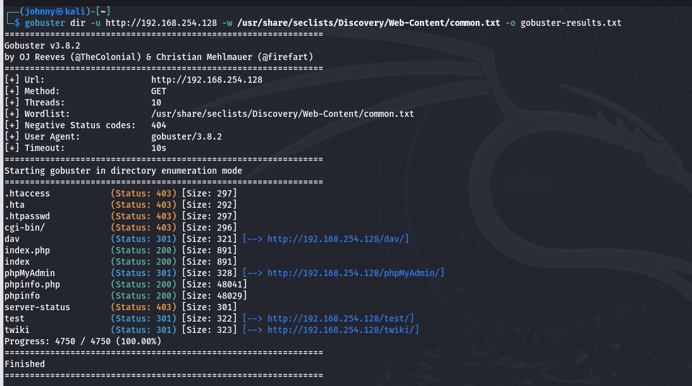

# Gobuster Directory Enumeration

## Objective

The objective of this lab was to perform web directory enumeration against a Metasploitable 2 web server using Gobuster. The goal was to discover hidden directories and files that could reveal additional information or possible attack surfaces.

## Tools Used

- Gobuster v3.8.2
- Kali Linux
- SecLists Wordlist
- Metasploitable 2

## Target Information

- Target IP: 192.168.254.128
- Service: HTTP
- Port: 80/tcp

## Command Used

```bash
gobuster dir -u http://192.168.254.128 -w /usr/share/seclists/Discovery/Web-Content/common.txt
[gobuster-results.txt](.htaccess            (Status: 403) [Size: 297]
.hta                 (Status: 403) [Size: 292]
.htpasswd            (Status: 403) [Size: 297]
...
twiki                (Status: 301) [--> http://192.168.254.128/twiki/])
## Evidence

### Gobuster Scan Screenshot



### Gobuster Results File

The complete scan output is available here:

[gobuster-results.txt](.htaccess            (Status: 403) [Size: 297]
.hta                 (Status: 403) [Size: 292]
.htpasswd            (Status: 403) [Size: 297]
...
twiki                (Status: 301) [--> http://192.168.254.128/twiki/])
