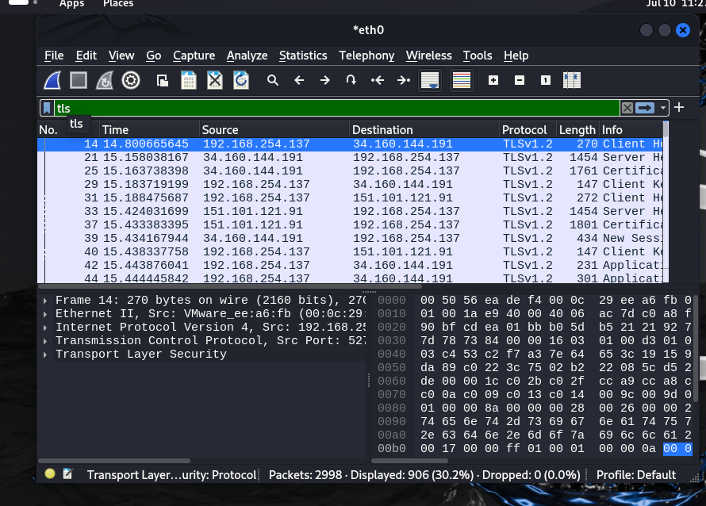
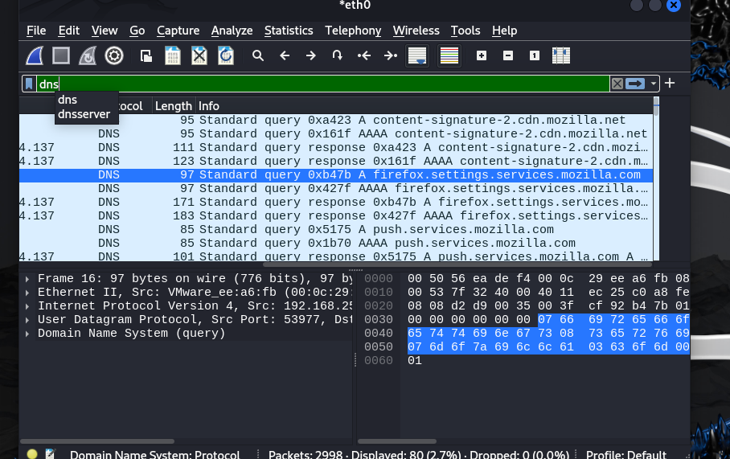
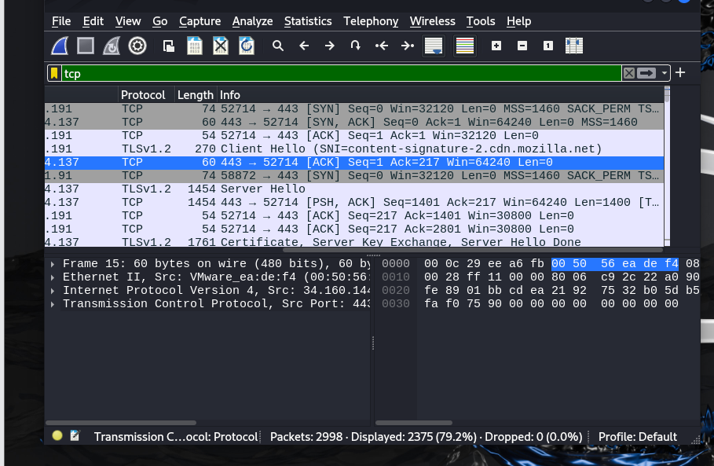
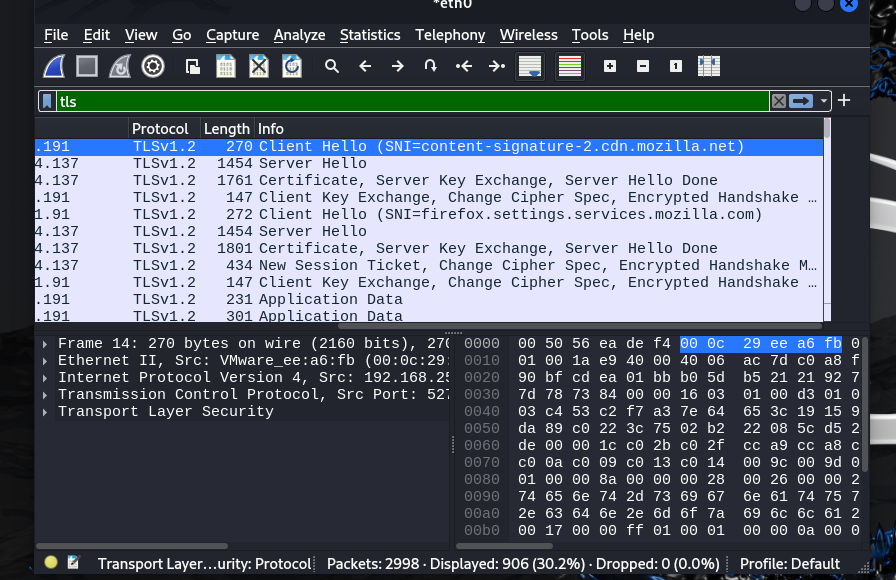

## Findings

### Packet Capture Summary

* Successfully captured **2,998** network packets during the analysis.
* Applied protocol-specific display filters to isolate and examine different types of network traffic.

### DNS Analysis

* The `dns` display filter identified **80** DNS packets.
* Observed DNS queries, including requests to `firefox.settings.services.mozilla.com`.
* Verified that DNS is responsible for resolving domain names into IP addresses before communication begins.

### TCP Analysis

* The `tcp` display filter identified **2,375** TCP packets.
* Observed the TCP three-way handshake (`SYN`, `SYN, ACK`, and `ACK`), confirming the establishment of a reliable connection between the client and the server.

### TLS Analysis

* The `tls` display filter identified **906** TLS packets.
* Observed key TLS handshake messages, including **Client Hello**, **Server Hello**, **Certificate**, and **Application Data**.
* Verified that TLS encrypts communication between the client and the server, helping protect transmitted data from unauthorized access.
## Screenshots

### Full Packet Capture

### DNS Analysis

### TCP Handshake

### TLS Filter

### TLS Packet Details

