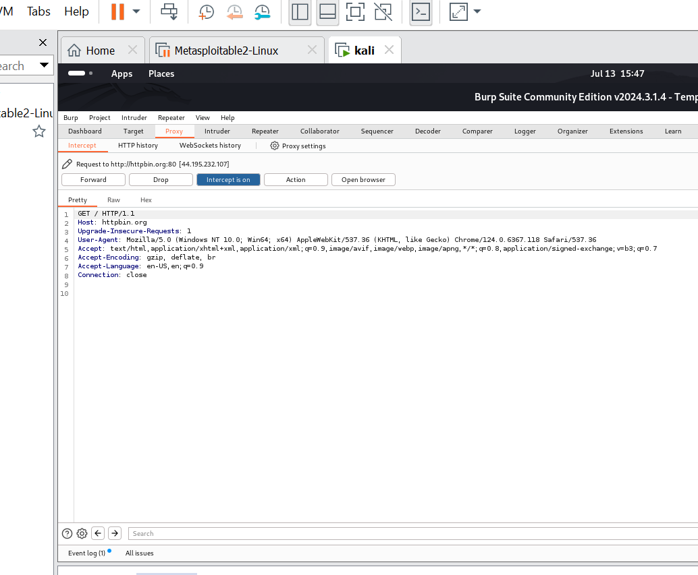
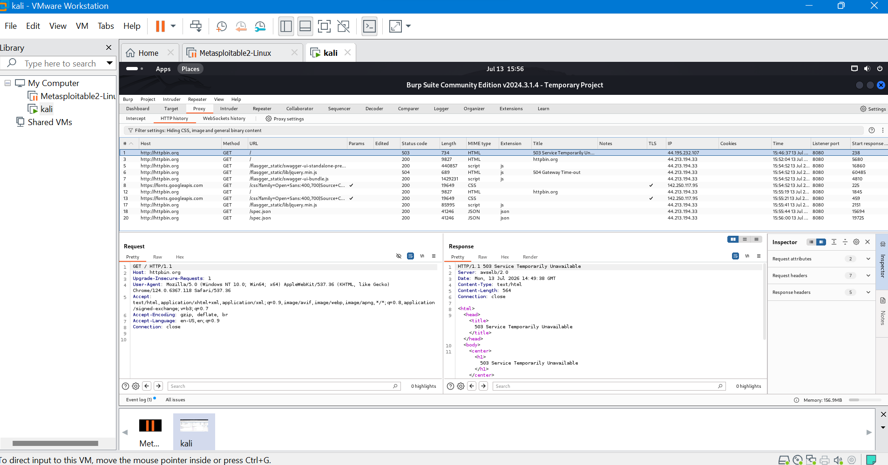
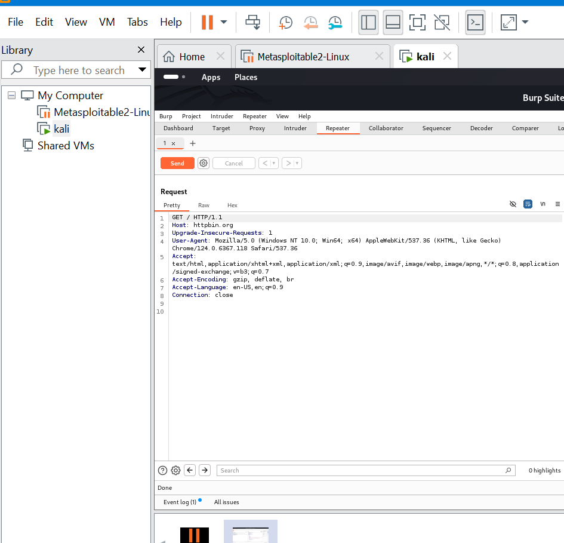
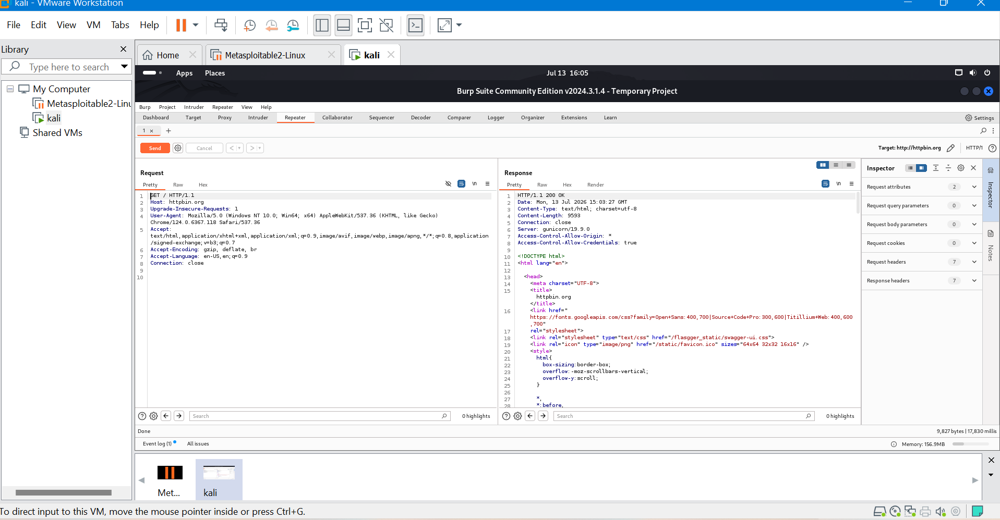
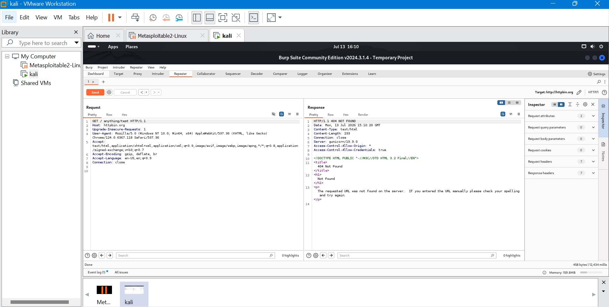

# Burp Suite Web Security Lab

## Overview
This lab demonstrates the use of Burp Suite Community Edition for basic web application security testing and HTTP traffic analysis.

## Tool Used
- Burp Suite Community Edition v2024.3.1.4

## Objectives
- Configure Burp Suite as an intercepting proxy
- Capture and analyze HTTP requests
- Review HTTP history
- Use Burp Repeater to resend requests
- Modify requests and observe server responses

## Lab Activities

1. Configured Burp Suite proxy listener.
2. Connected the Burp browser to the proxy.
3. Intercepted HTTP requests.
4. Reviewed captured traffic using HTTP History.
5. Sent requests to Burp Repeater.
6. Modified and resent requests to analyze responses.

## Skills Demonstrated

- HTTP request/response analysis
- Web traffic interception
- Proxy configuration
- Request manipulation
- Basic web security testing methodology

## Screenshots

### Burp Proxy - Intercepted Request

### HTTP History

### Burp Repeater Request

### Burp Repeater Response

### Modified Request Testing

## Conclusion

This lab provided hands-on experience with Burp Suite and introduced fundamental techniques used in web application security testing.
