# Splunk Failed Login Analysis

## Project Overview

This project demonstrates the use of Splunk Enterprise as a Security Information and Event Management (SIEM) platform to analyze Windows security events and investigate authentication activity.

The goal of this project was to simulate a SOC analyst workflow by collecting, searching, analyzing, and visualizing security logs to identify suspicious login activity, monitor user behavior, and understand security event patterns.

Unlike my previous Splunk project where logs were manually imported, this project focuses on automated log ingestion and real-world SIEM investigation processes.

---

# Objectives

* Configure Splunk Enterprise for security event analysis
* Analyze Windows Security Event Logs using SPL queries
* Investigate failed and successful authentication attempts
* Identify privileged account activity
* Analyze user behavior patterns
* Create security visualizations and dashboards
* Practice SOC analyst investigation techniques

---

# Tools & Technologies Used

* Splunk Enterprise
* SPL (Search Processing Language)
* Windows Security Event Logs
* Windows Event Viewer
* Splunk Dashboard Visualizations

---

# Lab Environment

**Operating System**

* Windows 11

**SIEM Platform**

* Splunk Enterprise

**Log Source**

* Windows Security Event Logs

---

# Investigations Performed

## 1. Failed Logon Attempts

**Objective:**
Identify unsuccessful authentication attempts and investigate possible brute-force activity.

### SPL Query

```spl
index=* EventCode=4625
| stats count by Account_Name, Source_Network_Address
| sort -count
```

### Investigation Results

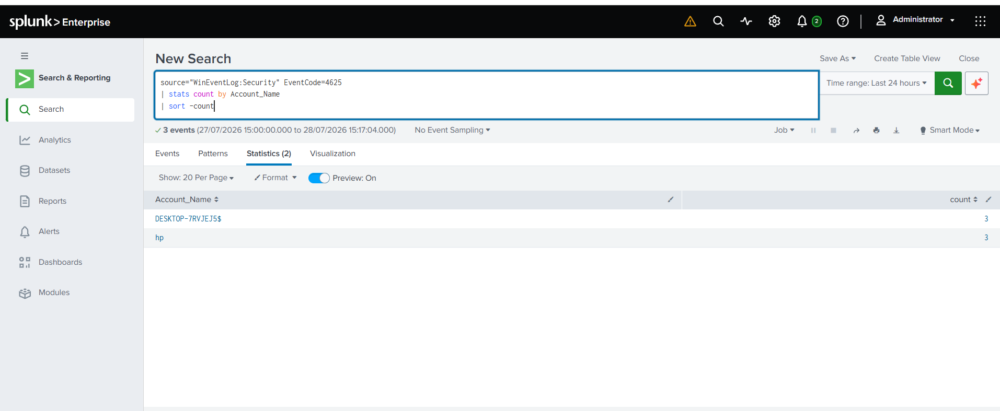

### Visualization

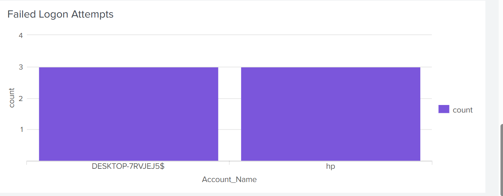

---

# 2. Successful Logons

**Objective:**
Analyze successful authentication events and identify account access activity.

### SPL Query

```spl
index=* EventCode=4624
| stats count by Account_Name, Logon_Type
| sort -count
```

### Investigation Results

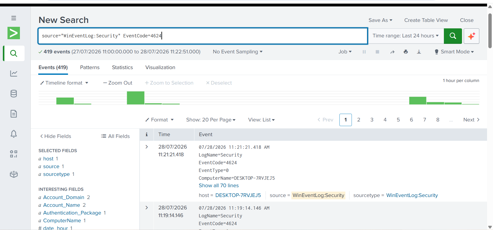

### Visualization

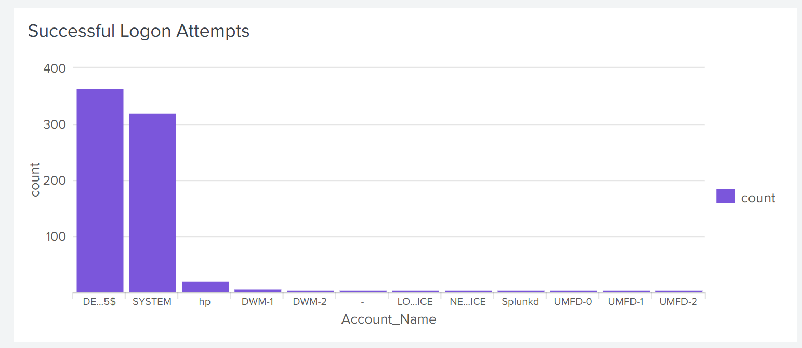

---

# 3. Privilege Logon Events

**Objective:**
Identify privileged account logon activity that may require additional monitoring.

### SPL Query

```spl
index=* EventCode=4672
| stats count by Account_Name
| sort -count
```

### Investigation Results

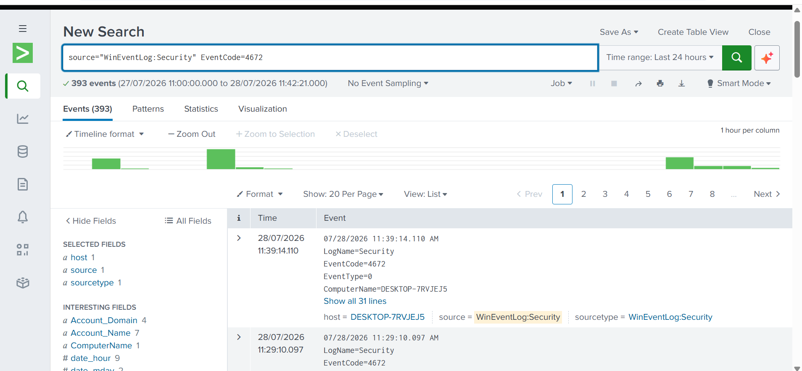

### Visualization

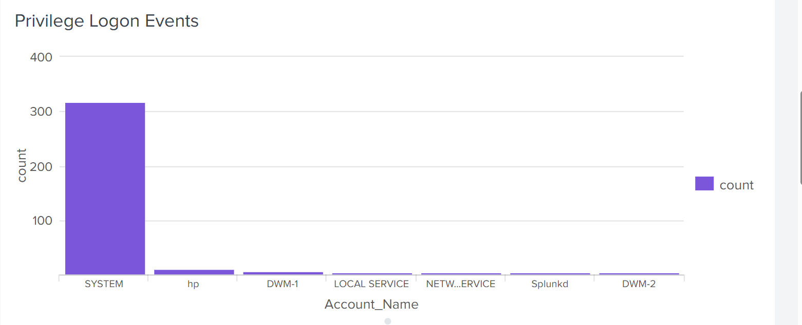

---

# 4. Event Type Analysis

**Objective:**
Analyze the distribution of Windows security events within the environment.

### SPL Query

```spl
index=*
| stats count by EventCode
| sort -count
```

### Investigation Results

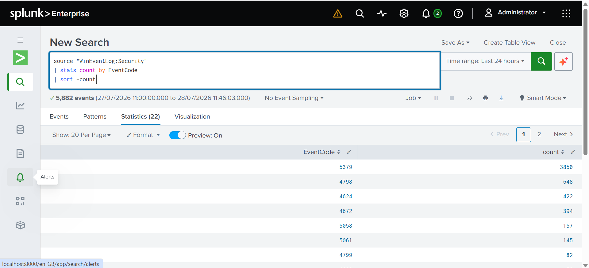

### Visualization


---

# 5. Top User Activity Analysis

**Objective:**
Identify users generating the highest number of security events.

### SPL Query

```spl
index=*
| stats count by Account_Name
| sort -count
```

### Investigation Results

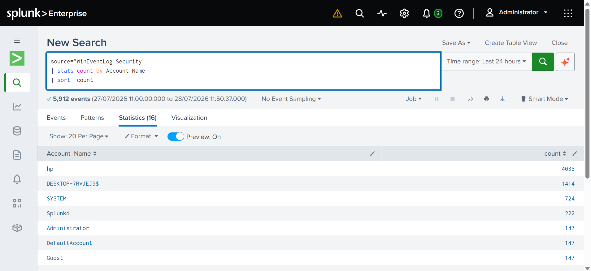

### Visualization

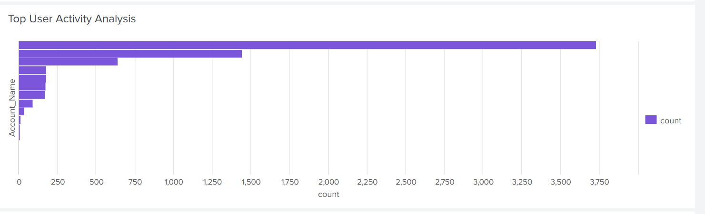

---

# 6. Security Event Activity Timeline

**Objective:**
Analyze security events over time to identify activity patterns and unusual behavior.

### SPL Query

```spl
index=*
| timechart count by EventCode
```

### Investigation Results

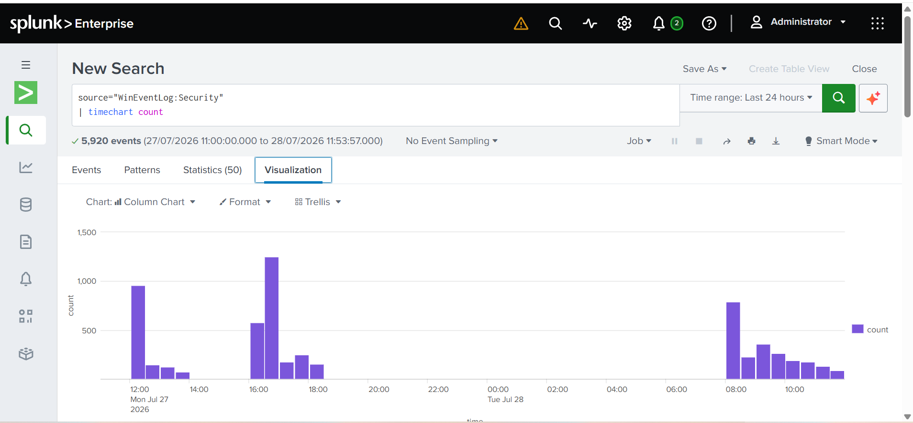

### Visualization

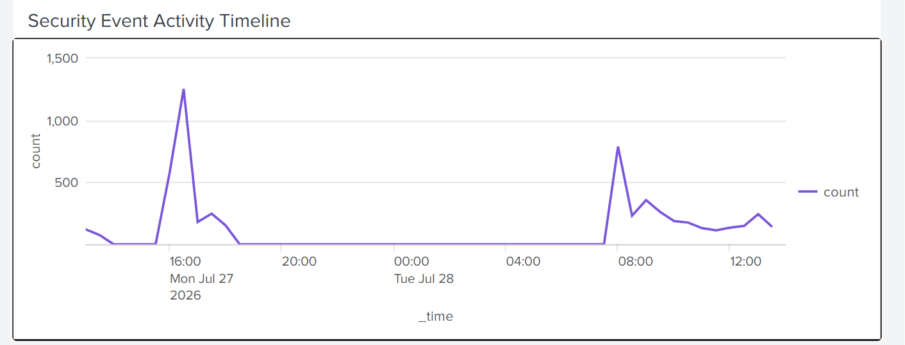

---

# # Splunk Dashboard

A centralized Splunk dashboard was created to provide an overview of authentication activity and security events.

The dashboard includes:

- Failed login attempts
- Successful logons
- Privileged logon events
- Event type analysis
- Top user activity
- Security event timeline

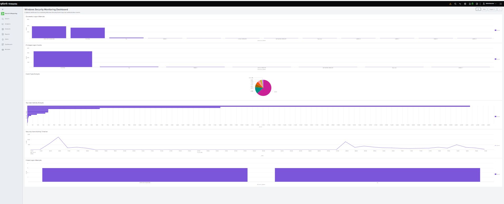

---

# Key Findings

* Detected failed authentication attempts using Windows Event ID 4625
* Reviewed successful authentication activity using Windows Event ID 4624
* Investigated privileged access activity using Windows Event ID 4672
* Identified user activity trends through SPL queries
* Created visual reports for security monitoring
* Practiced SIEM-based investigation workflow

---

# Skills Demonstrated

* Splunk Enterprise
* SPL Query Writing
* SIEM Monitoring
* Windows Event Log Analysis
* Authentication Investigation
* Security Dashboard Creation
* SOC Analyst Investigation Process

---

# MITRE ATT&CK Mapping

| Technique         | ID    | Description                                       |
| ----------------- | ----- | ------------------------------------------------- |
| Valid Accounts    | T1078 | Monitoring legitimate account usage               |
| Brute Force       | T1110 | Detecting repeated failed authentication attempts |
| Account Discovery | T1087 | Reviewing account activity                        |

---

# Conclusion

This project demonstrates practical SIEM investigation skills using Splunk Enterprise to analyze Windows security events.

The investigation process reflects real SOC analyst responsibilities, including authentication monitoring, event correlation, threat detection, log analysis, and security reporting.

By completing this project, I gained hands-on experience with Splunk searches, dashboards, and security event investigation workflows.
