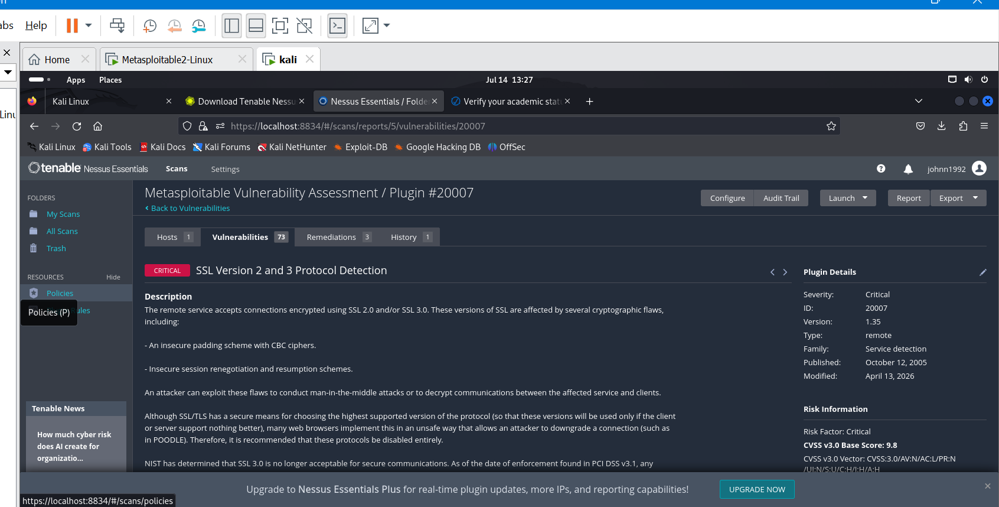
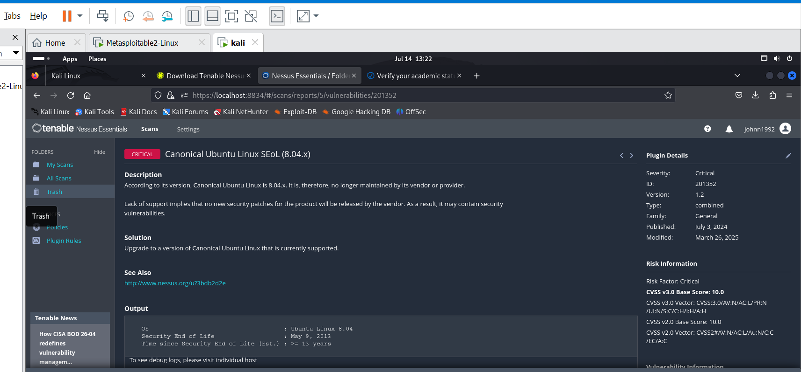
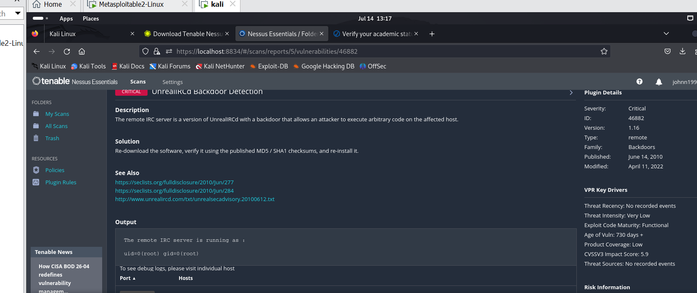
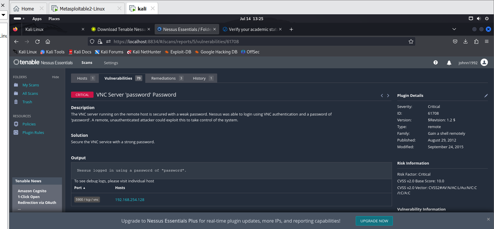
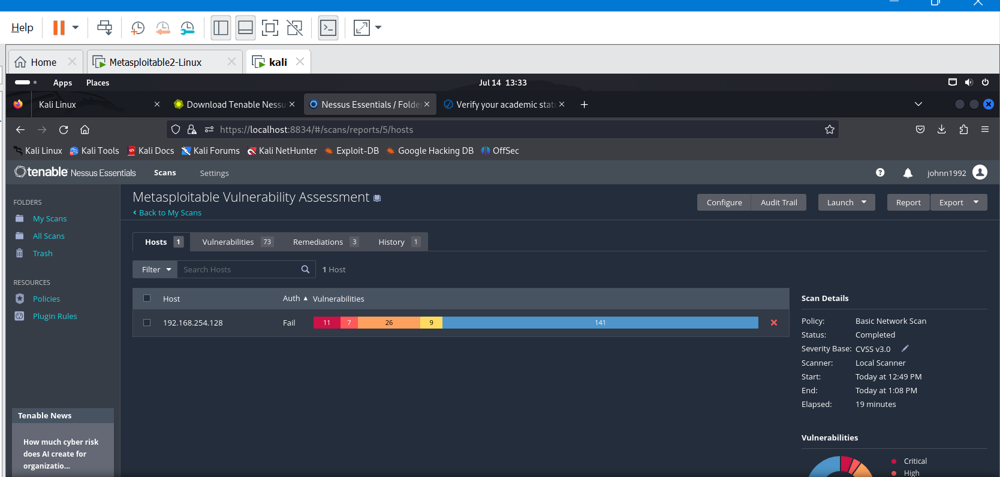
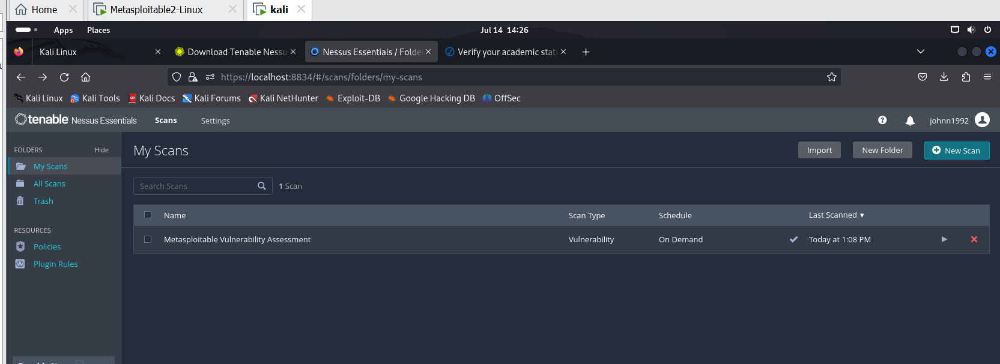
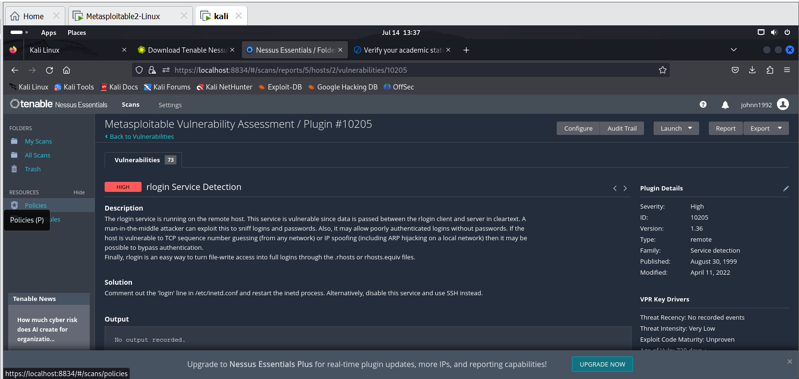
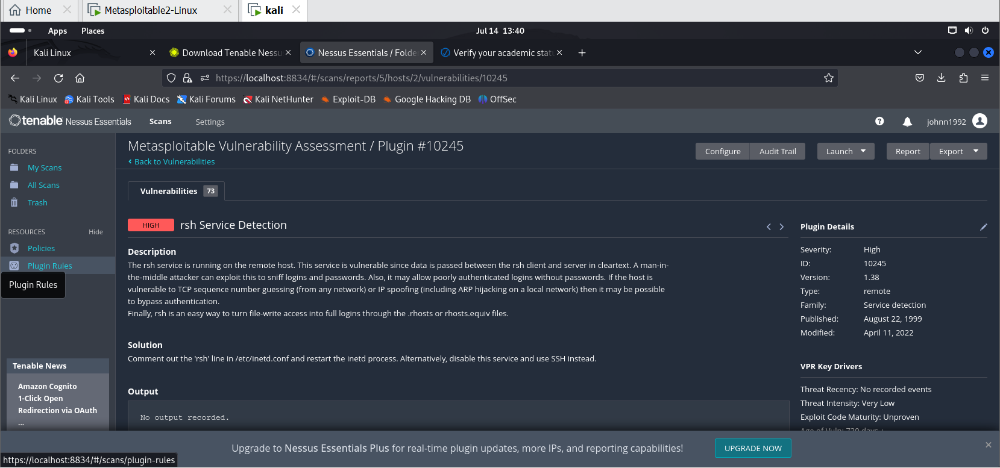
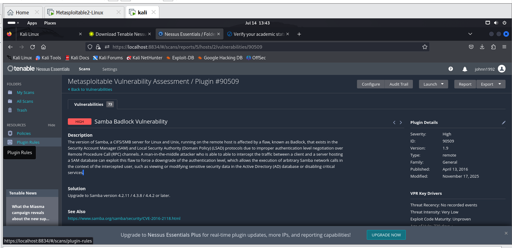
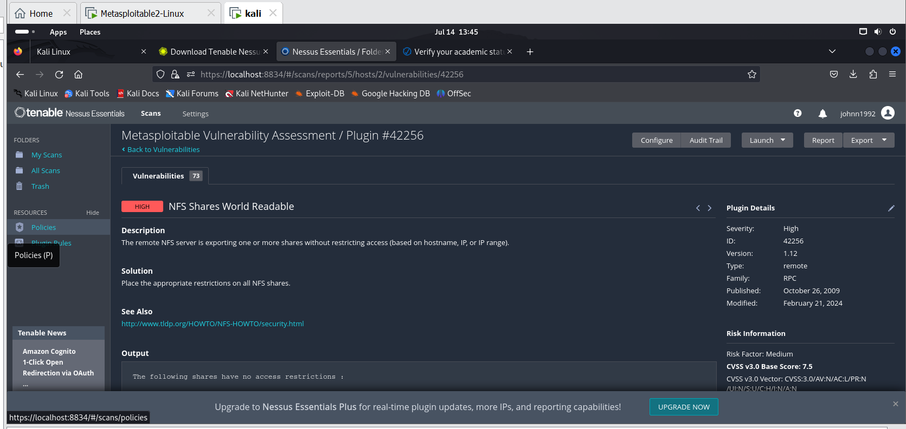

Nessus Vulnerability Assessment
Overview

This project demonstrates a vulnerability assessment performed using Nessus Essentials against a deliberately vulnerable virtual machine in a controlled lab environment. The objective was to identify security weaknesses, analyze their severity, review remediation recommendations, and document the results as part of a cybersecurity portfolio.

The assessment identified multiple Critical, High, and Medium severity vulnerabilities affecting network services and encryption protocols. These findings highlight common security misconfigurations and outdated services that could expose systems to unauthorized access or data compromise.

Objectives
Perform a vulnerability assessment using Nessus Essentials.
Identify vulnerabilities across network services and protocols.
Review risk severity using Nessus vulnerability ratings.
Analyze remediation recommendations.
Document findings in a professional assessment report.
Lab Environment---

## Tools Used

- Nessus Essentials
- VMware Workstation
- Metasploitable 2
- Windows 11

---

## Scan Methodology

The assessment followed a structured vulnerability assessment process:

1. Configured the Nessus Essentials scanner.
2. Identified the target host within the lab network.
3. Executed a vulnerability scan against the target.
4. Analyzed vulnerabilities by severity level.
5. Reviewed technical details and remediation recommendations.
6. Documented findings with supporting screenshots.

---

## Scan Summary

| Severity | Count |
|----------|------:|
| Critical | 4 |
| High | 4 |
| Medium | 4 |
| Low | 3 |
| Informational | 24 |

A total of **12 vulnerabilities** were identified during the assessment. The most significant findings included insecure remote login services, vulnerable Samba components, exposed NFS shares, outdated encryption protocols, and weak SSL/TLS configurations.

---
Component	Details
Scanner	Nessus Essentials
Target	Metasploitable 2
Host OS	Windows 11
Virtualization	VMware Workstation
Scanner Type	Authenticated/Unauthenticated Internal Lab Scan (based on your configuration)

Note: This assessment was performed in a controlled lab environment for educational purposes only.
A total of **15 vulnerabilities** were identified during the assessment, including Critical, High, Medium, and Low severity findings. This project focuses on the Critical, High, and Medium findings because they represent the highest security risks and best demonstrate the vulnerability assessment process.
## Critical Findings

The following Critical vulnerabilities were identified during the assessment. These issues present the highest level of risk and require immediate remediation.

| Finding | Risk | Recommendation |
|----------|------|----------------|
| SSL Version 2 and 3 Protocol Detection | Critical | Disable SSLv2/SSLv3 and enable TLS 1.2 or TLS 1.3. |
| Ubuntu 8.04 LTS End of Life | Critical | Upgrade to a supported operating system version. |
| UnrealIRCd Backdoor | Critical | Upgrade or replace the vulnerable version of UnrealIRCd immediately. |
| VNC Weak Password | Critical | Configure a strong password and restrict unauthorized remote access. |

---

### Critical Finding 1 – SSL Version 2 and 3 Protocol Detection

**Severity:** Critical

**Description:**  
The target system supports obsolete SSLv2 and/or SSLv3 protocols. These protocols contain well-known security weaknesses that can compromise encrypted communications.

**Recommendation:**  
Disable SSLv2 and SSLv3 completely and use TLS 1.2 or TLS 1.3.

---

### Critical Finding 2 – Ubuntu 8.04 LTS End of Life

**Severity:** Critical

**Description:**  
The target system is running Ubuntu 8.04 LTS, which has reached end of life and no longer receives security updates, leaving it exposed to unpatched vulnerabilities.

**Recommendation:**  
Upgrade to a currently supported Ubuntu release and apply all available security updates.

---

### Critical Finding 3 – UnrealIRCd Backdoor

**Severity:** Critical

**Description:**  
The installed version of UnrealIRCd contains a known backdoor that can allow an attacker to execute arbitrary commands on the affected server.

**Recommendation:**  
Upgrade to a secure version of UnrealIRCd and remove any compromised installations.

---

### Critical Finding 4 – VNC Weak Password

**Severity:** Critical

**Description:**  
The VNC service is protected by a weak password that can be guessed or cracked, potentially allowing unauthorized remote access.

**Recommendation:**  
Configure a strong, unique password and limit VNC access to trusted users and networks.

---

---

### Critical Finding 1 – SSL Version 2 and 3 Protocol Detection

**Severity:** Critical

**Description:**  
The target system supports the obsolete SSLv2 and/or SSLv3 protocols. These protocols contain well-known security weaknesses and should not be used because they expose encrypted communications to attacks.

**Recommendation:**  
Disable SSLv2 and SSLv3 completely and use TLS 1.2 or TLS 1.3.

---

### Critical Finding 2 – Ubuntu 8.04 LTS End of Life

**Severity:** Critical

**Description:**  
The target system is running Ubuntu 8.04 LTS, which is no longer supported and does not receive security updates. End-of-life operating systems expose systems to numerous unpatched vulnerabilities.

**Recommendation:**  
Upgrade to a currently supported Ubuntu release and apply all available security updates.

---

---

---
## High Findings

The following High severity vulnerabilities were identified during the assessment. While not as severe as the Critical findings, they still represent significant security risks that should be addressed promptly.

| Finding | Risk | Recommendation |
|----------|------|----------------|
| rlogin Service Detection | High | Disable the rlogin service and use SSH for secure remote access. |
| rsh Service Detection | High | Disable the rsh service and replace it with SSH. |
| Samba Badlock Vulnerability | High | Upgrade Samba to a version that addresses CVE-2016-2118. |
| NFS Shares World Readable | High | Restrict NFS exports to trusted hosts and networks. |

### Screenshots

#### rlogin Service Detection

#### rsh Service Detection

#### Samba Badlock Vulnerability

#### NFS Shares World Readable

---
