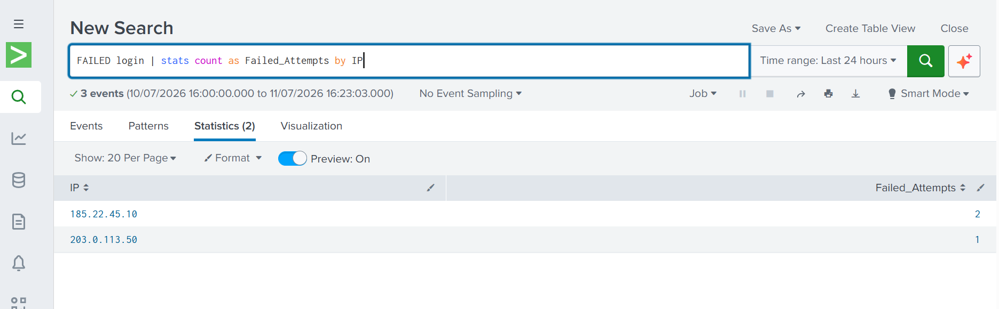

# Splunk Failed Login Analysis

## Project Overview

This project demonstrates how Splunk can be used to analyze authentication logs and identify failed login attempts using Splunk Search Processing Language (SPL).

## Objective

The objectives of this lab are to:

* Import log data into Splunk.
* Search for failed login events.
* Count failed login attempts by IP address.
* Identify potentially suspicious login activity.

## Tools Used

* Splunk Enterprise
* Windows 11
* Sample log file (`failed_login.log`)

## Dataset

The dataset contains successful and failed login events from multiple IP addresses.

## SPL Query

```spl
FAILED login
| stats count as Failed_Attempts by IP
```

## Results

*The SPL query returned the following failed login attempts:

IP Address	Failed Attempts
185.22.45.10	2
203.0.113.50	1

## Screenshots


## Analysis

The SPL query identified failed login attempts from two different IP addresses. The IP address 185.22.45.10 recorded 2 failed login attempts, making it the most suspicious source in the dataset. The IP address 203.0.113.50 recorded 1 failed login attempt.

Using the stats command made it easy to aggregate the events by IP address and quickly identify systems that may require further investigation.

## Conclusion

This lab demonstrated how Splunk can be used to import log data, search for failed login events, and summarize the results using SPL. The analysis successfully identified the IP addresses responsible for failed login attempts, showing how Splunk supports efficient log analysis and basic security monitoring.
